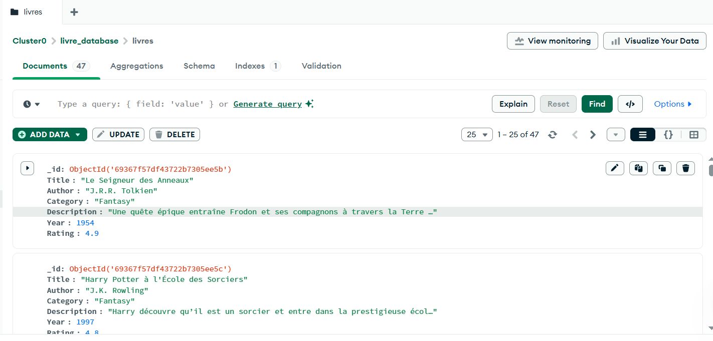

# 📘 Moteur de Recommandation de Livres (IA + MongoDB + Streamlit)

## 📚 Présentation du projet

Ce projet consiste à développer une application web intelligente permettant de recommander des livres grâce à la recherche sémantique. L'utilisateur saisit une phrase décrivant le type de livre recherché, et l'application renvoie automatiquement les œuvres les plus pertinentes en se basant sur le sens de la phrase, et non sur des mots-clés.

Le système utilise :
* **MongoDB Atlas** pour stocker une base de livres
* **Sentence Transformers** pour encoder les descriptions en vecteurs
* La **similarité cosinus** pour comparer la requête aux livres
* **Streamlit** pour l'interface utilisateur

Ce projet montre comment créer un moteur de recommandation moderne basé sur l'IA et les embeddings.

---

## 🧠 Logique générale du moteur de recommandation

### 1. Chargement des données
L'application récupère les livres dans MongoDB (Title, Author, Category, Description, Year, Rating).

### 2. Vectorisation
Chaque description est transformée en vecteur numérique (embedding) à l'aide du modèle `paraphrase-multilingual-mpnet-base-v2`.

### 3. Requête utilisateur
Le texte saisi est également converti en embedding.

### 4. Calcul de similarité cosinus
On compare l'embedding de la requête avec tous les embeddings des livres pour mesurer leur proximité sémantique.

#### 🔢 Formule utilisée (similarité cosinus)

$$\cos(\theta) = \frac{\vec{q} \cdot \vec{d}}{\|\vec{q}\| \, \|\vec{d}\|}$$

Avec :

* **Produit scalaire** :
  
  $$\vec{q} \cdot \vec{d} = \sum_{i=1}^{n} q_i d_i$$

* **Normes** :
  
  $$\|\vec{q}\| = \sqrt{\sum_{i=1}^{n} q_i^2}$$
  
  $$\|\vec{d}\| = \sqrt{\sum_{i=1}^{n} d_i^2}$$

Le résultat est compris entre :
* **+1** → très similaire
* **0** → pas de lien
* **-1** → opposé (rare pour ce type d'embeddings)

### 5. Tri des résultats
Les livres sont classés du plus pertinent au moins pertinent et affichés dans l'interface.

---

# 📌 Modèle utilisé : paraphrase-multilingual-mpnet-base-v2

## 🔹 Description générale

`paraphrase-multilingual-mpnet-base-v2` est un modèle **Sentence Transformers** qui transforme des phrases en vecteurs numériques représentant leur sens, permettant une comparaison sémantique entre textes.

---

## 🌍 Modèle multilingue

Le modèle comprend plus de **50 langues**, dont le français. Il gère efficacement des descriptions de livres variées, quel que soit le style, la longueur ou la langue utilisée.

---

## 🧠 Basé sur MPNet

Construit sur l'architecture **MPNet**, une version améliorée de BERT, le modèle offre :
- une meilleure compréhension du contexte
- une cohérence sémantique plus forte
- des représentations vectorielles plus riches

---

## 🔍 Optimisé pour la similarité sémantique

Entraîné sur des paires de phrases paraphrasées, il peut :
- détecter des textes ayant le même sens
- mesurer leur similarité
- produire des embeddings directement comparables via la **similarité cosinus**

---

## 🗂️ Structure du projet
```
.
├── livre_app.py        # Application Streamlit
├── README.md           # Documentation du projet
└── screenshots/        # Captures de l'application
```

---

## ⚙️ Étapes du projet

### ✔️ 1. Création de la base MongoDB
* Cluster Atlas
* Base `livre_database`
* Collection `livres`
* Import des documents JSON




### ✔️ 2. Développement de l'IA
* Chargement du modèle SentenceTransformer
* Vectorisation des descriptions
* Calcul des similarités cosinus

### ✔️ 3. Création de l'interface Streamlit
* Barre de recherche
* Résultats affichés proprement
* Pertinence, auteur, catégorie, résumé…


### ✔️ 4. Test et déploiement local

---

## ▶️ Comment exécuter l'application

### 1️⃣ Activer l'environnement virtuel

**Windows PowerShell :**
```powershell
.\env\Scripts\Activate.ps1
```

### 2️⃣ Lancer l'application
```bash
streamlit run livre_app.py
```

---

## 📦 Dépendances principales

* `streamlit`
* `pymongo`
* `sentence-transformers`
* `scikit-learn`
* `numpy`

---

## 🚀 Fonctionnalités

✅ Recherche sémantique intelligente  
✅ Interface utilisateur intuitive  
✅ Calcul de pertinence en temps réel  
✅ Affichage des métadonnées des livres  
✅ Base de données MongoDB dans le cloud  

---
